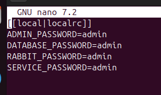
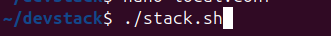

# Instalación, configuración y despliegue de Openstack en Ubuntu 24.04

El repositorio tiene la finalidad de documentar el proceso completo para lograr la implementación y despliegue de una infraestructura de desarrollo, utilizando OpenStack (DevStack como como IaaS). En adición, y como mecanismo de validación de resultados, se desplegará una aplicación CRUD como prueba de validación para el funcionamiento de la infraestructura.

Para lograr esta meta, se generó una máquina virtual en Oracle VirtualBox, en la que se montó una imagen de Ubuntu, sobre la que se realizó todo el proceso expuesto a continuación.

## ¿Qué es OpenStack?

## Preparación del entorno

El despliegue se realizó en VirtualBox, a continuación una captura que ilustra las especificaciones elegidas: 

Además, se sugiere la configuración de **Adaptador Puente** en cuanto a la conección de red.

A partir de allí, una vez ejecutada la instancia, se hace una instalación normal de Ubuntu. 

## Instalación de Openstack mediante la IAAS

Una vez lista la máquina virtual, se clona el repositorio propuesto por Devstack para la instalación de OpenStack`git clone https://opendev.org/openstack/devstack.git`, como se ilusta a continuación:

Hecho esto, debemos establecer una configuración que permita al instalador determinar las credenciales a usar en la infraestuctura. Esto lo podemos lograr mediante el siguiente comando:

En el archivo `local.conf` que debemos crear en la carpeta del repositorio recién clonado, debemos añadir la siguiente información:

Nótese que los valores establecidos son arbitrarios, y no deben ser estrictamente los propuestos para esta implementación.

Hecho esto, ejecutamos el archivo `stack.sh` mediante el comando `./stack.sh`, como ilustramos aquí:

Este comando ejecutará todas las instalaciones requeridas para que la infraestructura se instale correctamente.

###Problema presentado

	Openstack dejaba de funcionar despues de reiniciar la Máquina virtual
	
	La solución a esto se implementó cuando se detectó que el guest disk estaba insertado y ocupaba un espacio que Devstack usaba para inicializarse, al retirarlo este error se arregla.

## Configuración de OpenStack

## Despliegue de la Imagen

## Despliegue del CRUD

## Conclusiones 