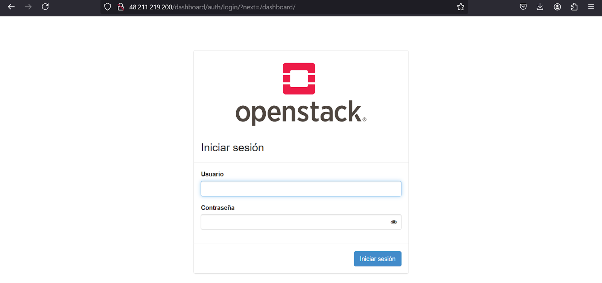
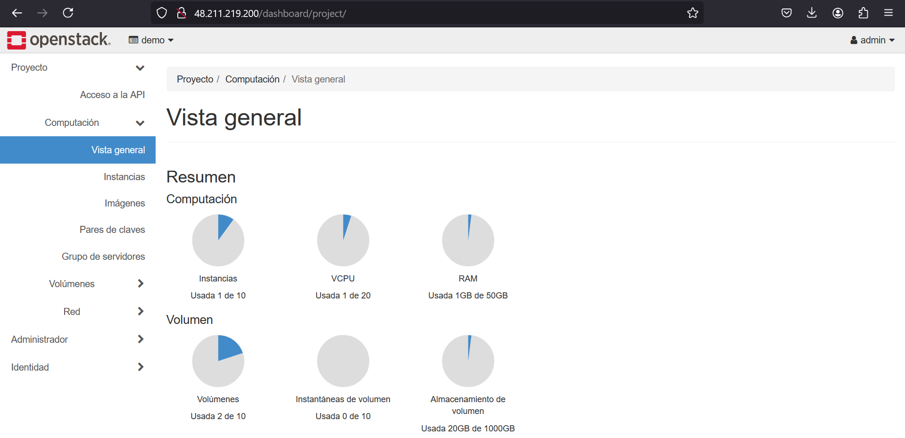

# Instalación, configuración y despliegue de Openstack en Ubuntu 24.04

## Resumen

OpenStack es un proyecto de computación en la nube para proporcionar una infraestructura como servicio (IaaS).

Es un software libre y de código abierto distribuido bajo los términos de la licencia Apache. El proyecto está gestionado por la Fundación OpenStack, una persona jurídica sin fines de lucro creada en septiembre de 2012 para promover el software OpenStack y su comunidad.

### Ventajas de Openstack

1. **Código abierto**: Es gratuito y de código abierto, con una gran comunidad de soporte.  
2. **Escalabilidad**: Permite gestionar grandes infraestructuras de forma eficiente y escalable.  
3. **Flexibilidad**: Compatible con diferentes hipervisores, sistemas operativos y arquitecturas de hardware.  
4. **Automatización**: Ofrece herramientas para automatizar la creación, gestión y despliegue de recursos.  
5. **Modularidad**: Está compuesto por múltiples componentes modulares que se pueden integrar según las necesidades.  
6. **Interoperabilidad**: Soporta APIs estándar, facilitando la integración con otras plataformas y servicios.  
7. **Ahorro de costos**: Reduce costos operativos al evitar licencias propietarias.  
8. **Seguridad**: Incluye herramientas para la gestión de políticas de seguridad y control de acceso.  
9. **Innovación constante**: Evoluciona rápidamente gracias a contribuciones de la comunidad y grandes empresas.  
10. **Soporte empresarial**: Ofrece opciones de soporte por parte de proveedores líderes como Red Hat, Canonical o SUSE.  

---

Con ese contexto, este repositorio tiene la finalidad de documentar el proceso completo para lograr la implementación y despliegue de una infraestructura de desarrollo, utilizando OpenStack (DevStack como como IaaS). En adición, y como mecanismo de validación de resultados, se desplegará una aplicación CRUD como prueba de validación para el funcionamiento de la infraestructura.

Para lograr esta meta, se generó una máquina virtual en Oracle VirtualBox, en la que se montó una imagen de Ubuntu, sobre la que se realizó todo el proceso expuesto a continuación.

## Preparación del entorno

El despliegue se realizó en VirtualBox, a continuación una captura que ilustra las especificaciones elegidas: 

Además, se sugiere la configuración de **Adaptador Puente** en cuanto a la conección de red.

A partir de allí, una vez ejecutada la instancia, se hace una instalación normal de Ubuntu. 

## Instalación de Openstack mediante la IAAS

Una vez lista la máquina virtual, se clona el repositorio propuesto por Devstack para la instalación de OpenStack`git clone https://opendev.org/openstack/devstack.git`, como se ilusta a continuación:

Hecho esto, debemos establecer una configuración que permita al instalador determinar las credenciales a usar en la infraestuctura. Esto lo podemos lograr mediante el siguiente comando:

En el archivo `local.conf` que debemos crear en la carpeta del repositorio recién clonado, debemos añadir la siguiente información:

Nótese que los valores establecidos son arbitrarios, y no deben ser estrictamente los propuestos para esta implementación.

Hecho esto, ejecutamos el archivo `stack.sh` mediante el comando `./stack.sh`, como ilustramos aquí:

Este comando ejecutará todas las instalaciones requeridas para que la infraestructura se instale correctamente.

### Problema presentado

	Openstack dejaba de funcionar despues de reiniciar la Máquina virtual
	
	La solución a esto se implementó cuando se detectó que el guest disk estaba insertado y ocupaba un espacio que Devstack usaba para inicializarse, al retirarlo este error se arregla.

Una vez terminada la instalación, poderemos acceder al dashboard de Horizon mediante la estructura de URL `[ip de la máquina virtual]/dashboard/auth/login/?next=/dashboard/`. Deberemos ver la siguiente interfaz:

Podremos loguearnos con las credenciales definidas previamente, permitiendonos ver algo similar a esto:

## Carga en OpenStack

## Despliegue de la Imagen

## Despliegue del CRUD

## Conclusiones 